<div align="center">

# Ulamat

### Learn what every Muslim must know — and say it correctly.


An AI listens to your Arabic and marks it word by word. Scholars give the rulings.<br>
Web app, installable PWA, and native Android + iOS from one codebase.

[](https://github.com/shovovai/Ulamat/stargazers)
[](https://github.com/shovovai/Ulamat/network/members)
[](https://github.com/shovovai/Ulamat/issues)
[](https://github.com/shovovai/Ulamat/commits)


**English · বাংলা · العربية · اردو · Bahasa Indonesia**

</div>

<p align="center">
  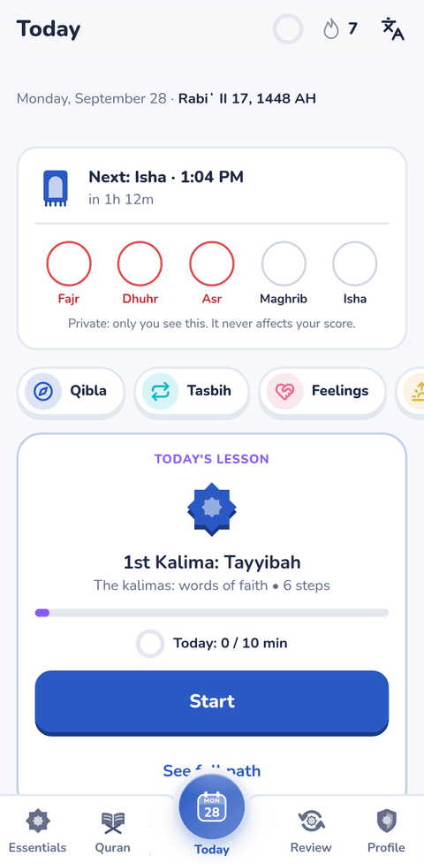
  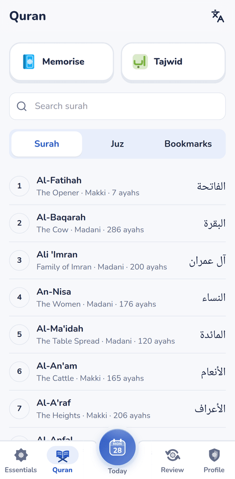
  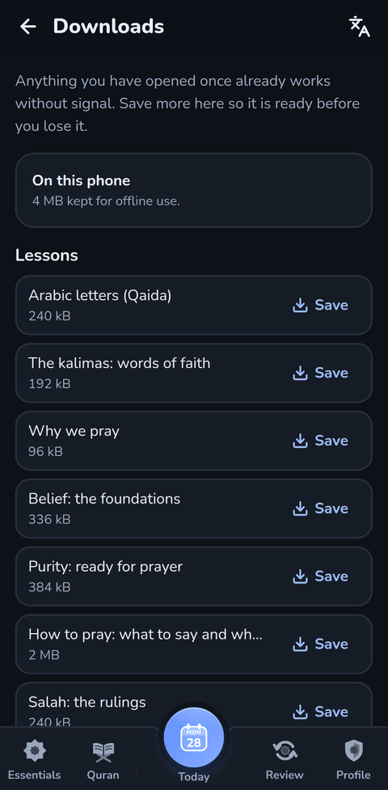
</p>

---

## Contents

- [Why it exists](#why-it-exists)
- [Screenshots](#screenshots)
- [Features](#features)
- [Stack](#stack)
- [Run it](#run-it)
- [Configuration](#configuration)
- [Native apps](#native-apps)
- [Layout of the repo](#layout-of-the-repo)
- [Documentation](#documentation)
- [Content and review](#content-and-review)
- [Privacy](#privacy)
- [Contributing](#contributing)

---

## Why it exists

Most people who want to pray correctly are not short of information. They are short of a straight path through it, in their own language, that tells them honestly whether they got the Arabic right.

Three commitments decide everything else in this repo:

> **1. No invented religion.** Every ruling is attributed to a named scholar with a source. The AI may judge pronunciation — never fiqh.
>
> **2. Honest feedback.** The check says *"not sure"* when it is not sure. The score counts only what has been **mastered**, not what has been seen.
>
> **3. Built for the phone people actually have.** Offline first. Downloads show their size before you tap. No autoplaying video, no music, no dark patterns.

---

## Screenshots

| Today | Learning path | Quran |
|:--:|:--:|:--:|
|  | 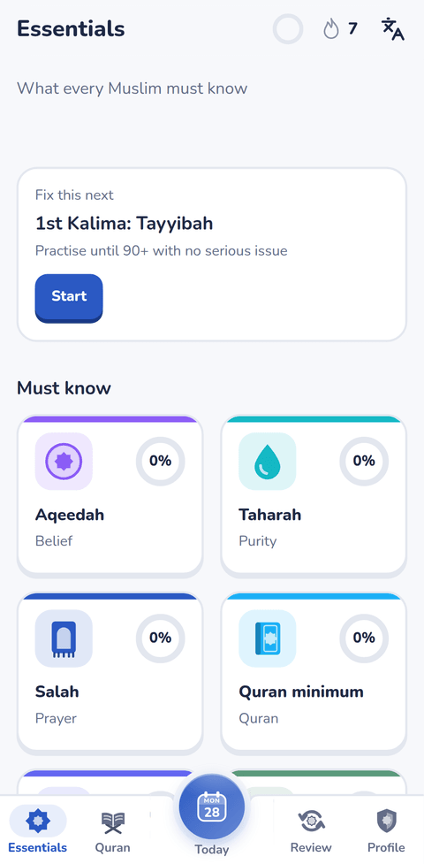 |  |
| **Prayer times** | **Memorisation** | **Offline downloads** |
| 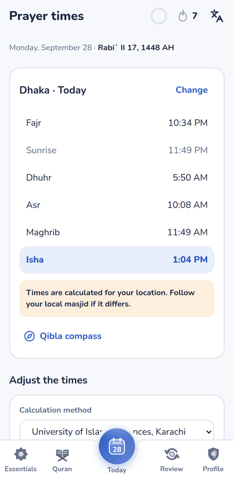 | 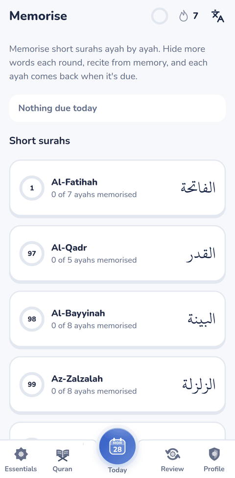 | 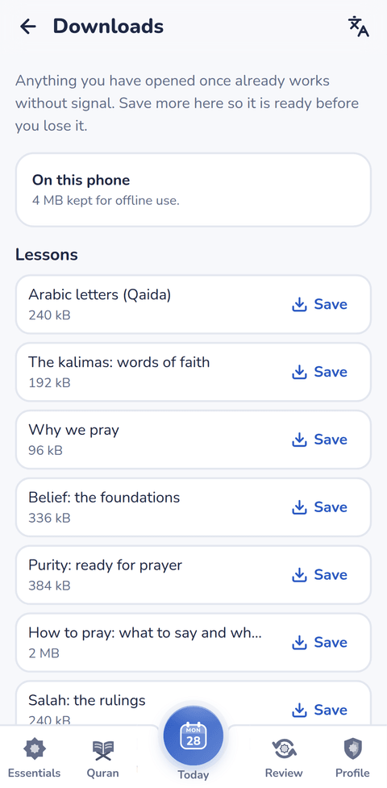 |
| **Tasbih** | **Zakat calculator** | **Dark mode** |
| 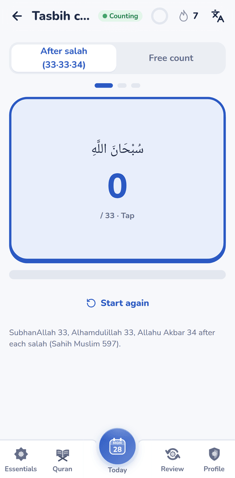 | 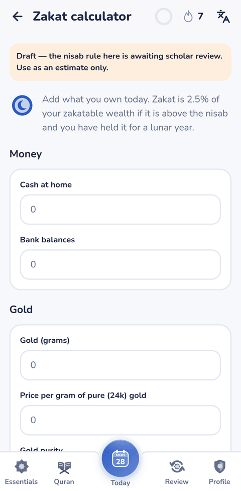 | 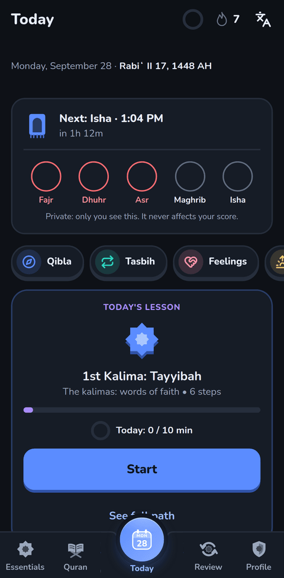 |

<details>
<summary><b>Desktop</b></summary>

<p align="center">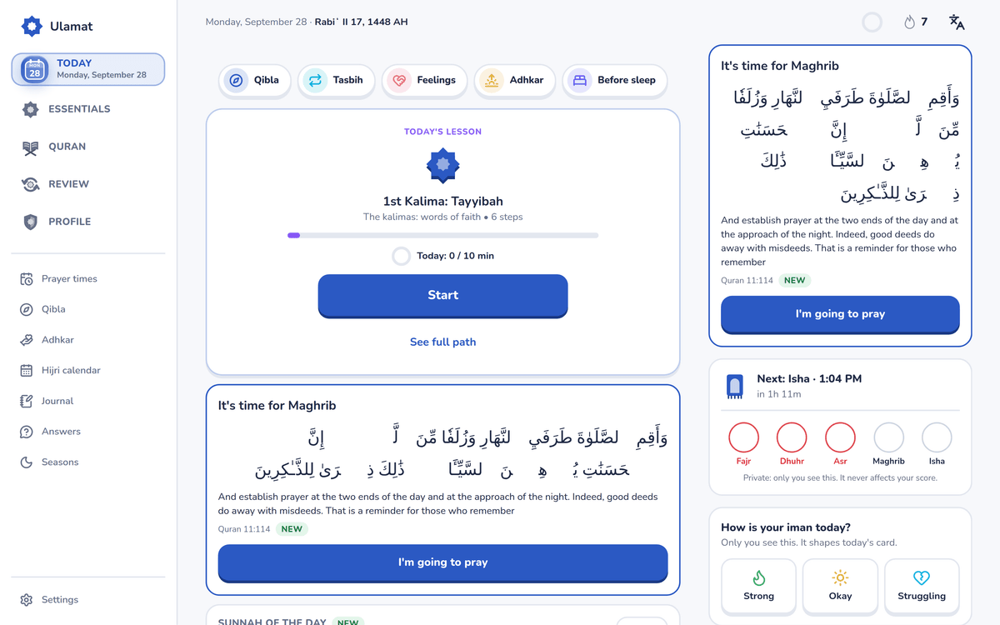</p>
<p align="center">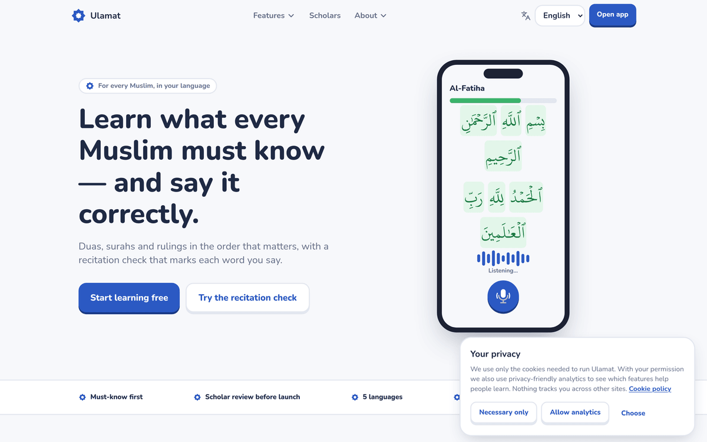</p>


<details>
<summary><b>More of dark mode</b></summary>

<p align="center">
  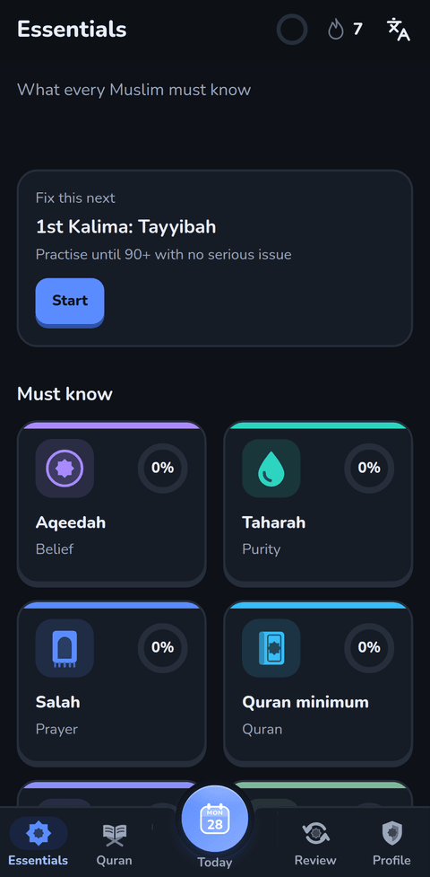
  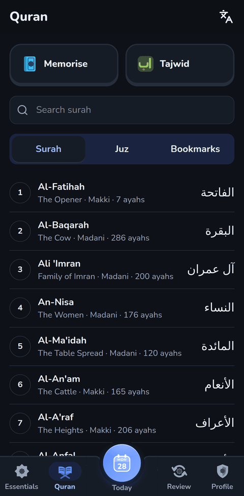
  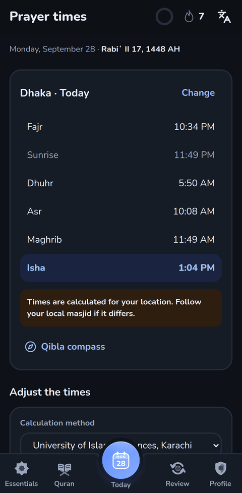
</p>

Dark is its own palette, not the light one dimmed — every pair measured against WCAG contrast.


---

## Features

### Learning

- **Onboarding** — 10 short steps with skip-friendly defaults, then a placement check (recite Al-Fatiha + 5 questions) that starts you where you actually are, not at the beginning.
- **Learning path** — 8-pointed star nodes; the gold edge draws itself as a lesson completes.
- **Lesson player** — learn → listen → repeat → recite → quiz → match → order the words → Arabic letters. Wrong answers come back at the end of the lesson, not the end of the week.
- **Qaida course** for Arabic letters from zero.
- **Walkthroughs** for salah, wudu and janazah, step by step, with practice inside each step.
- **Madhab and gender filtering** — Hanafi / Shafi'i / Maliki / Hanbali. *"Not sure"* shows every version with a note rather than choosing for you.


### Pronunciation check

- 16 kHz mono WAV recorded in the browser, live waveform, 60 s cap, slow playback, tap any word to hear it.
- Word-level result with a real **"not sure"** state; 3 attempts, then *Continue anyway* — nobody is trapped on one word.
- `POST /api/recite`: validation, speech endpoint with a 10 s timeout, normalization, Levenshtein word alignment, scoring, targeted tips, 30 requests/hour rate limit.
- **Audio is never stored.** It is scored and dropped.
- Noise handling: DC removal, framing, SNR estimate, silence trim, normalisation with a cap — a noisy room gets told it is a noisy room instead of being marked wrong.


### Quran

- Reader by surah / juz / bookmarks, search, continue reading.
- Translations (en / bn / ur / id), word by word, transliteration.
- Ayah audio from 4 reciters; tafsir in a sheet on mobile, a side panel on desktop.
- Practise any ayah against the pronunciation check; share; report a mistake.
- Offline copy of the text bundled, so the reader works when the API cannot be reached.


### Memorisation and review

- **Hifz** with spaced repetition and a memory test that hides the text.
- **Review** — "due today" capped at 10, a needs-practice list, review sessions.


### Daily life

Prayer times (`adhan`, madhab-aware), qibla, tasbih, adhkar, duas for feelings, before-sleep routine, hijri calendar, sadaqah and gratitude journal, zakat calculator, Ramadan and seasonal modes.


### Motivation

Learning Score (weighted, with decay), streaks with 2 freezes a month, daily goal ring, badges, activity calendar. A sound on every outcome — short tones built in code, never music.


### Offline

- Everything opened once keeps working with no network.
- The service worker **precaches** the shell and every tool that is arithmetic or stored text: prayer times, qibla, tasbih, adhkar, duas, sleep, hijri calendar, journal, zakat, hifz, tajwid, seasons.
- **`/downloads`** — choose what else to carry: a lesson unit, any juz 1–30, or the daily duas. **Every pack shows its size before you tap it**, storage is persisted so packs are not evicted when the phone fills up, and deleting a pack gives the space back.


### Accounts and privacy

- 5 days of full use with no account. After that sign-in is asked for once, and it returns you to the page you were on.
- Email + password, one-time email verification code, password reset by code, Cloudflare Turnstile against bots.
- Optional 6-digit device PIN (PBKDF2-SHA-256, 210,000 iterations; 10 wrong tries wipes local data). It locks *this device* — deliberately not a server credential.
- Guest → account merge keeps the higher score per item.
- Download my data; delete account and data.


### Admin

Staff roles with TOTP 2FA, audit log, content review queue, dua audio management, referrals, maintenance mode. Non-staff get a 404, not a login wall.


---

## Stack

| Layer | Choice |
|---|---|
| Framework | Next.js 16, App Router, `proxy.ts` |
| Language | TypeScript, strict |
| Styling | Tailwind CSS v4, design tokens, dark mode |
| Animation | Framer Motion |
| i18n | next-intl — en, bn, ar, ur, id, with RTL and localized digits |
| Backend | Supabase (Postgres + RLS + Auth) |
| Prayer times | `adhan` |
| Arabic shaping | `harfbuzzjs` |
| Native | Capacitor 8 (Android + iOS) |
| Push | FCM HTTP v1 (native), Web Push + VAPID (browser) |
| Speech | faster-whisper + `tarteel-ai/whisper-base-ar-quran`, self-hosted |
| Hosting | Vercel |
| Tests | Vitest (unit), Playwright (e2e) |

---

## Layout of the repo

```
app/            routes — (main) app, (site) public website, (focus) lesson player, (panel) admin
components/     UI, grouped by area
content/        the curriculum: duas, surahs, rulings, quizzes, walkthroughs, scholars
lib/            logic — scoring, prayer times, offline packs, auth gate, speech, store
messages/       interface text: en, bn, ar, ur, id
supabase/       migrations, schema and RLS
speech-server/  self-hosted pronunciation engine (FastAPI + faster-whisper)
android/ ios/   Capacitor native shells
native/         icon and splash source assets
public/         static files, service worker
docs/           the full product spec
tests/          unit tests (vitest)
e2e/            end-to-end tests (playwright)
scripts/        i18n check, content hashing, review queue, evaluation
```

---

## Documentation

The full spec lives in [`docs/`](docs):

| Document | What it covers |
|---|---|
| [`FEATURES.md`](docs/FEATURES.md) | Every feature, by area |
| [`FUNCTIONALITY.md`](docs/FUNCTIONALITY.md) | How each one behaves, including offline |
| [`DESIGN.md`](docs/DESIGN.md) | Tokens, type, colour, dark mode |
| [`LAYOUT.md`](docs/LAYOUT.md), [`MOBILE_VIEW.md`](docs/MOBILE_VIEW.md), [`WEB_VIEW.md`](docs/WEB_VIEW.md) | Layout at each size |
| [`CONTENT.md`](docs/CONTENT.md) | How curriculum content is written and reviewed |
| [`DATA_AND_API.md`](docs/DATA_AND_API.md) | Tables, endpoints, environment variables |
| [`AUTH.md`](docs/AUTH.md) | Sign-in, the trial, the device PIN |
| [`PUSH.md`](docs/PUSH.md) | Web Push and FCM |
| [`SPEECH.md`](docs/SPEECH.md), [`PRONUNCIATION_ENGINE.md`](docs/PRONUNCIATION_ENGINE.md), [`PRONUNCIATION_EVAL.md`](docs/PRONUNCIATION_EVAL.md) | The recitation check |
| [`NATIVE_PHASE.md`](docs/NATIVE_PHASE.md) | Capacitor, deep links, the widget |
| [`SCHOLAR_REVIEW.md`](docs/SCHOLAR_REVIEW.md), [`REVIEW_QUEUE.md`](docs/REVIEW_QUEUE.md) | How rulings get approved |
| [`ROADMAP.md`](docs/ROADMAP.md) | What is next |

---

## Content and review

Curriculum content lives in `content/` as typed TypeScript, not in a database, so every change is a reviewable diff. Items carry their scholar attribution and sources. A review queue (`npm run review:queue`) tracks what still needs approval, and `NEXT_PUBLIC_REQUIRE_REVIEW` hides anything unreviewed from readers.

Found a mistake? The flag icon on any item opens a short form. It lands in `content_reports` with the item id and app version.

---

## Privacy

- Recitation audio is scored and dropped. It is never stored.
- Analytics are opt-in.
- Guest progress never leaves the device until an account is made.
- The device PIN is a local lock, hashed with a per-device salt; the digits are never sent anywhere.
- Every user can export their data and delete their account from Settings.

---


<div align="center">

If this is useful to you, a star helps other people find it.

[](https://github.com/shovovai/Ulamat)

</div>
